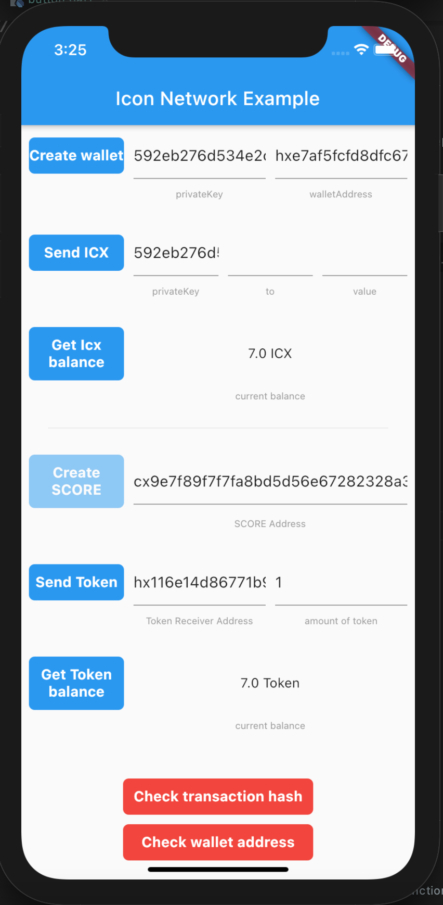

# flutter_icon_network

**environment:**
  - sdk: ">=2.7.0 <3.0.0"
  - flutter: ">=1.20.0"

A Flutter plugin to work with native Android/Ios sdk of Icon network

**To track:** https://bicon.tracker.solidwallet.io/ \
**Native SDK:** https://www.icondev.io/docs/sdk-overview

**Features:** create wallet, send icx to testnet, check balance, deploy smart contract, send token, check token balance

Supported `Android`, `Ios`



# Install:
```
  flutter_icon_network:
    git: https://git.baikal.io/mobile/boilerplate/flutter_icon_network
```

# Init:
```
FlutterIconNetwork.instance.init(host: "https://bicon.net.solidwallet.io/api/v3", isTestNet: true);
```
# Wallet Functions:
##### getBalance:
return current balance
```
final balance = await FlutterIconNetwork.instance.getIcxBalance(privateKey: yourPrivateKey);
```
##### sendIcx:
send Icx to an `address`
return the `transaction hash`
```
final txHash = await FlutterIconNetwork.instance.sendIcx(
                        yourPrivateKey: yourPrivateKey,
                        destinationAddress: address,
                        value: 1
                     )
```
##### createWallet:
create a new wallet
return the `Wallet` object that contain the `privateKey` and `address`
```
final wallet = await FlutterIconNetwork.instance.createWallet;
```
# SmartContract Functions:
##### deployContract: only available in android, on ios the sdk not support yet
to deploy a SCORE by choose the zip file contain the source code
```
final transactionResult = await FlutterIconNetwork.instance.deployScore(
                            privateKey: privateKey, initIcxSupply: "10");
```
the result will container txHash, SCORE address

##### send token:
to send token to a address throught SCORE
```
final response = await FlutterIconNetwork.instance.sendToken(
        yourPrivateKey: privateKey,
        toAddress: receiverAddress,
        value: numOfToken);
```
will return the txHash

##### check token balance:
to check the token balance in SCORE
```
final balance = await FlutterIconNetwork.instance.getTokenBalance(
                                    privateKey: privateKey, 
                                    scoreAddress: scoreAddress);
```
will return current SCORE token balance

##### Test accounts:
**account 1:** 

privateKey: 592eb276d534e2c41a2d9356c0ab262dc233d87e4dd71ce705ec130a8d27ff0c

address: hxe7af5fcfd8dfc67530a01a0e403882687528dfcb

scoreAddress: cx9e7f89f7f7fa8bd5d56e67282328a3ca87a082b1

**account 2:** 

privateKey: bf589ba6e0b907dbc88b1e174444e79f39df24f8e5d0ba6bf0e104f95a2ff2a6

address: hx116e14d86771b97d50aec933685e85ad7c1d5f30


